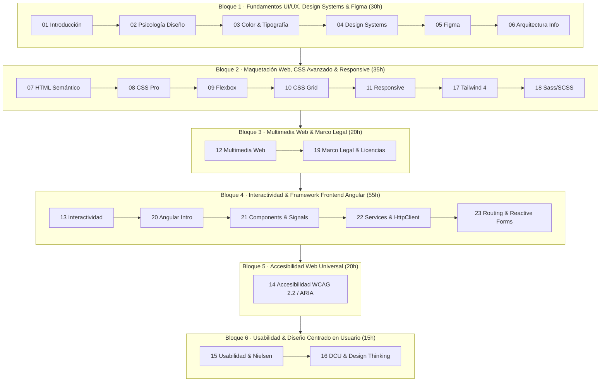

# Programación Didáctica · Diseño de Interfaces Web

**Módulo Profesional:** Diseño de Interfaces Web  
**Código oficial:** 0615 (Real Decreto 687/2010 y Orden de 16 de junio de 2011)  
**Ciclo Formativo de Grado Superior:** Técnico Superior en Desarrollo de Aplicaciones Web (DAW) — 2º Curso  
**Familia Profesional:** Informática y Comunicaciones  
**Carga Lectiva:** 175 horas totales (5 horas semanales durante el periodo lectivo en centro educativo + formación en empresa dual) · 9 créditos ECTS  
**Ámbito Territorial:** Comunidad Autónoma de Andalucía  
**Curso Académico:** 2025 / 2026 (y 2026 / 2027)  
**Departamento:** Informática y Comunicaciones  

---

## 1. Ficha Técnica del Módulo

| Elemento | Especificación y Datos del Módulo |
|---|---|
| **Denominación oficial** | Diseño de Interfaces Web |
| **Código del módulo** | 0615 (RD 687/2010 y Orden de 16 de junio de 2011) |
| **Ciclo formativo y curso** | 2º curso de Técnico Superior en Desarrollo de Aplicaciones Web (DAW) |
| **Carga horaria total** | 175 horas totales (5 horas semanales en periodo lectivo presencial + fase dual en empresa) |
| **Equivalencia crediticia** | 9 créditos ECTS (Grado Superior) |
| **Régimen de impartición** | Formación Profesional Grado D - Régimen Dual General (400 horas totales de empresa en 2º curso, con 71 h vinculadas a DIW) |
| **Departamento didáctico** | Departamento de Informática y Comunicaciones |
| **Materiales de aula** | Repositorio digital del módulo: 23 unidades temáticas de apuntes y proyectos prácticos en `docs/` |

---

## 2. Introducción y Justificación Pedagógica

El módulo profesional de **Diseño de Interfaces Web (Código 0615)** se imparte en el segundo curso del Ciclo Formativo de Grado Superior de **Desarrollo de Aplicaciones Web (DAW)**. Constituye una materia nuclear en la formación del desarrollador web moderno, dotándolo de la capacidad para concebir, diseñar, maquetar, programar y auditar la capa de presentación y experiencia de usuario de aplicaciones web complejas.

!!!warning "Propósito Formativo del Módulo:" 
    Capacitar al futuro desarrollador frontend para transformar especificaciones y requisitos funcionales en interfaces web atractivas, intuitivas, responsivas, interactivas, semánticas y universalmente accesibles (WCAG 2.2 / WAI-ARIA), dominando el ecosistema de diseño con Figma, maquetación CSS avanzada (Grid, Flexbox, Tailwind CSS 4, Sass) y desarrollo SPA basado en componentes mediante frameworks frontend (Angular).

El módulo se articula en torno a 6 grandes ejes competenciales:

1. **Psicología del diseño y comunicación visual:** Percepción visual (Leyes de Gestalt), leyes de UX (Fitts, Hick, Miller, Jakob), teoría del color, ratios de contraste y tipografía web.
2. **Sistemas de diseño y prototipado:** Atomic Design, Design Tokens, maquetación visual y prototipado interactivo en Figma con Auto Layout, componentes y variantes.
3. **Maquetación web profesional y responsive:** HTML5 semántico, CSS moderno (Box Model, cascada, especificidad, Custom Properties, BEM), Flexbox, CSS Grid Layout, Container Queries, Mobile-First, Tailwind CSS 4 y Sass/SCSS.
4. **Multimedia web y marco legal:** Formatos modernos (WebP, AVIF, SVG interactivo), audio/vídeo HTML5 con subtítulos WebVTT, compresión de activos y cumplimiento estricto de la Ley de Propiedad Intelectual (TRLPI), licencias Creative Commons y RGPD/LOPDGDD.
5. **Interactividad y desarrollo frontend con frameworks (Angular):** Microinteracciones, animaciones CSS/JS, arquitectura por componentes Standalone, Data Binding, Signals, directivas de control de flujo (`@if`, `@for`), servicios, inyección de dependencias, consumo de APIs REST con `HttpClient`, RxJS, enrutamiento (`Angular Router`) y formularios reactivos.
6. **Accesibilidad web universal (A11y) y Usabilidad (UX):** Pautas WCAG 2.1/2.2 (A/AA/AAA), WAI-ARIA, auditorías con Lighthouse/axe/WAVE, lectores de pantalla (NVDA/VoiceOver), heurísticas de Nielsen, métricas SUS, Core Web Vitals y Diseño Centrado en el Usuario (DCU / Design Thinking).

---

## 3. Marco Normativo Vigente

La programación se fundamenta en la siguiente jerarquía normativa:

### 3.1 Normativa General del Sistema Educativo y Formación Profesional
- **Constitución Española de 1978** (Artículo 27): Derecho a la educación y principios formativos.
- **Ley Orgánica 2/2006, de 3 de mayo, de Educación (LOE)**, modificada por la **Ley Orgánica 3/2020, de 29 de diciembre (LOMLOE)**.
- **Ley Orgánica 3/2022, de 31 de marzo**, de ordenación e integración de la Formación Profesional.
- **Real Decreto 659/2023, de 18 de julio**, por el que se desarrolla la ordenación del Sistema de Formación Profesional.
- **Real Decreto 687/2010, de 20 de mayo**, por el que se establece el título de Técnico Superior en Desarrollo de Aplicaciones Web y se fijan sus enseñanzas mínimas.
- **Real Decreto 405/2023, de 29 de mayo**, y **Real Decreto 500/2024, de 21 de mayo**, de actualización de títulos de Formación Profesional.

### 3.2 Normativa Autonómica de la Comunidad Autónoma de Andalucía
- **Estatuto de Autonomía para Andalucía (Ley Orgánica 2/2007, de 19 de marzo):** Artículos 21 y 52.
- **Ley 17/2007, de 10 de diciembre, de Educación de Andalucía (LEA).**
- **Decreto 104/2024, de 28 de mayo**, por el que se establece la ordenación del Sistema de Formación Profesional en la Comunidad Autónoma de Andalucía (*deroga el Decreto 436/2008*).
- **Orden de 18 de septiembre de 2025**, por la que se regula la evaluación, certificación, acreditación y titulación académica del alumnado de Grados D y E en Andalucía (*deroga la Orden de 29 de septiembre de 2010*).
- **Orden de 26 de septiembre de 2025**, por la que se regula la fase de formación en empresa u organismo equiparado en Andalucía.
- **Orden de 16 de junio de 2011**, por la que se desarrolla el currículo correspondiente al título de Técnico Superior en Desarrollo de Aplicaciones Web en Andalucía.
- **Decreto 327/2010, de 13 de julio** (Reglamento Orgánico de IES) y **Orden de 20 de agosto de 2010** (Organización y funcionamiento de IES en Andalucía).

### 3.3 Normativa de Accesibilidad, Propiedad Intelectual y Protección de Datos
- **Real Decreto 1112/2018, de 7 de septiembre**, sobre accesibilidad de los sitios web y aplicaciones para dispositivos móviles del sector público (trasposición de la Directiva UE 2016/2102).
- **Ley 11/2023, de 8 de mayo** (trasposición del Acta Europea de Accesibilidad - Directiva UE 2019/882).
- **Real Decreto Legislativo 1/1996 (TRLPI)**, Ley de Propiedad Intelectual y régimen de licencias abiertas (Creative Commons, MIT, Apache, GPL).
- **Reglamento (UE) 2016/679 (RGPD)** y **Ley Orgánica 3/2018 (LOPDGDD)** de Protección de Datos Personales y garantía de los derechos digitales.

---

## 4. Contexto del Alumnado (2º DAW)

El grupo de 2º DAW está integrado por 9 alumnos/as procedentes de Martos y municipios de la comarca (Torredelcampo, Fuensanta de Martos, Jaén capital):

- **Edad:** Rango de 18 a 31 años, mostrando alta motivación profesional hacia el desarrollo web.
- **Rendimiento previo:** La gran mayoría promocionó de 1º DAW con todas las materias superadas. 2 alumnos repetidores cuentan con seguimiento individualizado.
- **Convalidaciones:** 2 alumnos con convalidación autorizada en el módulo de IPE II.
- **Atención a la diversidad:** No se registran informes formales de NEAE en orientación, aplicándose pautas de Diseño Universal para el Aprendizaje (DUA) con actividades multinivel de refuerzo y ampliación.

---

## 5. Objetivos Generales y Competencias del Título

El módulo contribuye directamente a los siguientes objetivos generales (Orden de 16 de junio de 2011):

- **i)** Utilizar lenguajes de marcas y estándares web, asumiendo el manual de estilo, para desarrollar interfaces en aplicaciones web.
- **j)** Emplear herramientas y lenguajes específicos para desarrollar componentes multimedia.
- **k)** Evaluar la interactividad, accesibilidad y usabilidad de una interfaz para integrar componentes multimedia.
- **l)** Utilizar herramientas y lenguajes para desarrollar e integrar componentes software.
- **ñ)** Verificar los componentes software desarrollados completando el plan de pruebas.
- **o)** Utilizar herramientas específicas para elaborar y mantener la documentación técnica.
- **y)** Identificar y proponer las acciones profesionales necesarias para dar respuesta a la accesibilidad universal y al diseño para todos.

---

## 6. Resultados de Aprendizaje y Criterios de Evaluación

| RA | Resultado de Aprendizaje Oficial | Criterios de Evaluación Oficiales (CE) | Ponderación |
|:---|:---|:---|:---:|
| **RA1** | Planifica la creación de una interfaz web valorando y aplicando especificaciones de diseño. | **a)** Se ha reconocido la importancia de la comunicación visual y sus principios básicos. **b)** Se han analizado y seleccionado los colores y tipografías adecuados para pantalla. **c)** Se han analizado alternativas para la presentación de información web. **d)** Se ha valorado la importancia de definir y aplicar la guía de estilo. **e)** Se han utilizado y valorado distintas tecnologías para el diseño web. **f)** Se han creado y utilizado plantillas y prototipos de diseño. | **12 %** *(2% / CE)* |
| **RA2** | Crea interfaces web homogéneos definiendo y aplicando estilos. | **a)** Se han reconocido las posibilidades de modificar las etiquetas HTML. **b)** Se han definido estilos de forma directa. **c)** Se han definido y asociado estilos globales en hojas externas. **d)** Se han definido hojas de estilos alternativas. **e)** Se han redefinido estilos. **f)** Se han identificado las distintas propiedades de cada elemento. **g)** Se han creado clases y selectores de estilos. **h)** Se han utilizado herramientas de validación de hojas de estilos. **i)** Se han analizado y utilizado tecnologías y frameworks para diseño responsive. **j)** Se han analizado y utilizado preprocesadores de estilos (Sass/SCSS). | **20 %** *(2% / CE)* |
| **RA3** | Prepara archivos multimedia para la web, analizando sus características y manejando herramientas específicas. | **a)** Se han reconocido las implicaciones de licencias y derechos de autor. **b)** Se han identificado formatos de imagen, audio y vídeo a utilizar (WebP, AVIF, SVG). **c)** Se han analizado herramientas para generar contenido multimedia. **d)** Se han empleado herramientas para el tratamiento digital de la imagen. **e)** Se han utilizado herramientas para manipular audio y vídeo. **f)** Se han realizado animaciones a partir de imágenes fijas. **g)** Se han importado y exportado recursos multimedia en diversos formatos. **h)** Se ha aplicado la guía de estilo al material multimedia. | **16 %** *(2% / CE)* |
| **RA4** | Integra contenido multimedia en documentos web valorando su aportación y seleccionando adecuadamente los elementos interactivos. | **a)** Se han reconocido tecnologías de inclusión de contenido interactivo (2%). **b)** Se han configurado navegadores para contenido multimedia e interactivo (2%). **c)** Se han utilizado herramientas gráficas para contenido interactivo (4%). **d)** Se ha analizado el código generado por herramientas interactivas (4%). **e)** Se han agregado elementos multimedia a documentos web (4%). **f)** Se ha añadido interactividad a elementos web (4%). **g)** Se ha verificado el funcionamiento interactivo en múltiples dispositivos (4%). | **24 %** *(Pond. diferenciada)* |
| **RA5** | Desarrolla interfaces web accesibles, analizando las pautas establecidas y aplicando técnicas de verificación. | **a)** Se ha reconocido la necesidad de diseñar webs accesibles. **b)** Se ha analizado la accesibilidad de diferentes documentos web. **c)** Se han analizado los principios y pautas WCAG y niveles de conformidad. **d)** Se han analizado los posibles errores según prioridades de verificación. **e)** Se ha alcanzado el nivel de conformidad deseado (Nivel AA/AAA). **f)** Se han verificado los niveles mediante tests automatizados. **g)** Se ha verificado la visualización en múltiples navegadores y tecnologías asistivas. **h)** Se han utilizado herramientas que mejoren la visibilidad y accesibilidad (SEO/ARIA). | **16 %** *(2% / CE)* |
| **RA6** | Desarrolla interfaces web amigables analizando y aplicando las pautas de usabilidad establecidas. | **a)** Se ha analizado la usabilidad de diferentes documentos web. **b)** Se ha valorado la importancia de los estándares en la creación web. **c)** Se ha adecuado la interfaz web a los objetivos y usuarios destinatarios. **d)** Se ha verificado la facilidad de navegación mediante diversos periféricos. **e)** Se han analizado técnicas para verificar la usabilidad de un documento web. **f)** Se ha verificado la usabilidad en diferentes navegadores y dispositivos. | **12 %** *(2% / CE)* |

---

## 7. Secuenciación Didáctica y Compaginación con los Apuntes del Módulo (`docs/`)

El módulo se organiza en **6 Bloques Temáticos / Unidades de Trabajo** rigurosamente compaginados con los **23 documentos de apuntes** de la carpeta `docs/`:

### 7.1 Bloque 1 · UT 1: Fundamentos de UI/UX, Psicología del Diseño, Color, Tipografía, Sistemas de Diseño y Prototipado en Figma (30 horas)
- **Resultados de Aprendizaje:** RA1 (a–f) y RA6 (b, c).
- **Contenidos:** Psicología cognitiva, Leyes de Gestalt, leyes UX (Fitts, Hick, Miller, Jakob), teoría del color (RGB, HSL, Oklch, ratios de contraste WCAG), tipografía web, escalas modulares, Atomic Design, Design Tokens, arquitectura de información, Card Sorting, User Flows, Wireframes y Figma avanzado (Frames, Auto Layout, Componentes, Variantes, Constraints y prototipado Smart Animate).
- **Materiales de Apoyo (`docs/`):**
    - [`01. Introducción al Diseño de Interfaces Web`](index.md)
    - [`02-psicologia-diseno.md`](02-psicologia-diseno.md)
    - [`03-color-tipografia.md`](03-color-tipografia.md)
    - [`04-guias-estilo-design-systems.md`](04-guias-estilo-design-systems.md)
    - [`05-figma-profesional.md`](05-figma-profesional.md)
    - [`06-arquitectura-informacion.md`](06-arquitectura-informacion.md)

### 7.2 Bloque 2 · UT 2: Maquetación Web Profesional: HTML5 Semántico, CSS Avanzado, Flexbox, Grid y Responsive Design (35 horas)
- **Resultados de Aprendizaje:** RA2 (a–j).
- **Contenidos:** HTML5 semántico y SEO técnico (Schema.org), CSS moderno (Box Model, cascada, especificidad, `@layer`, Custom Properties, metodología BEM/ITCSS), Flexbox unidimensional, CSS Grid bidimensional (`grid-template-areas`, `minmax()`, `auto-fit`), Mobile-First, Container Queries (`@container`), imágenes responsivas (`<picture>`, `srcset`), Tailwind CSS 4 (`@theme`) y preprocesador Sass/SCSS (`@use`, `@forward`, mixins).
- **Materiales de Apoyo (`docs/`):**
    - [`07-html-semantico.md`](07-html-semantico.md)
    - [`08-css-profesional.md`](08-css-profesional.md)
    - [`09-flexbox.md`](09-flexbox.md)
    - [`10-css-grid-layout.md`](10-css-grid-layout.md)
    - [`11-responsive-design.md`](11-responsive-design.md)
    - [`17-tailwindcss4.md`](17-tailwindcss4.md)
    - [`18-preprocesadores-css.md`](18-preprocesadores-css.md)

### 7.3 Bloque 3 · UT 3: Multimedia Web, Optimización de Activos, Derechos de Autor y Licencias (20 horas)
- **Resultados de Aprendizaje:** RA3 (a–h).
- **Contenidos:** Formatos de imagen modernos (WebP, AVIF, SVG interactivo y optimización con SVGO), audio y vídeo HTML5 (`<audio>`, `<video>`, códecs H.264, VP9, AV1), subtítulos accesibles WebVTT (`<track>`), compresión de recursos, marco legal de propiedad intelectual (TRLPI), licencias Creative Commons, licencias de software (MIT, Apache, GPL) y privacidad RGPD.
- **Materiales de Apoyo (`docs/`):**
    - [`12-multimedia-web.md`](12-multimedia-web.md)
    - [`19-marco-legal-multimedia.md`](19-marco-legal-multimedia.md)

### 7.4 Bloque 4 · UT 4: Interactividad, Animaciones y Desarrollo Frontend por Componentes con Framework (Angular) (55 horas)
- **Resultados de Aprendizaje:** RA4 (a–g) y RA2 (i).
- **Contenidos:** Microinteracciones y animaciones CSS (`@keyframes`, timing functions), JavaScript DOM events, Web Animations API, arquitectura de Angular con componentes Standalone, TypeScript, Data Binding, Signals, directivas de control de flujo (`@if`, `@for`, `@switch`), Pipes, Servicios e Inyección de Dependencias, consumo de APIs REST con `HttpClient` y RxJS, enrutamiento con `Angular Router` (rutas hijas, Lazy Loading, Guards) y Formularios Reactivos con validación visual.
- **Materiales de Apoyo (`docs/`):**
    - [`13-interactividad-web.md`](13-interactividad-web.md)
    - [`20-angular-introduccion.md`](20-angular-introduccion.md)
    - [`21-angular-componentes-datos.md`](21-angular-componentes-datos.md)
    - [`22-angular-servicios-httpclient.md`](22-angular-servicios-httpclient.md)
    - [`23-angular-routing-formularios.md`](23-angular-routing-formularios.md)

### 7.5 Bloque 5 · UT 5: Accesibilidad Web Universal (WCAG 2.1/2.2, WAI-ARIA) y Validación Técnica (20 horas)
- **Resultados de Aprendizaje:** RA5 (a–h).
- **Contenidos:** Principios POUR de accesibilidad, pautas WCAG 2.2 (niveles A, AA y AAA), navegación por teclado y trampas de foco, especificación WAI-ARIA (roles, estados y propiedades dinámicas en SPA), herramientas de auditoría automatizada (axe DevTools, Lighthouse, WAVE) y pruebas con lectores de pantalla (NVDA, VoiceOver) conforme al RD 1112/2018 y Ley 11/2023.
- **Materiales de Apoyo (`docs/`):**
    - [`14-accesibilidad-web.md`](14-accesibilidad-web.md)
    - [`07-html-semantico.md`](07-html-semantico.md)

### 7.6 Bloque 6 · UT 6: Usabilidad Web, Métricas UX, Heurísticas y Diseño Centrado en el Usuario (DCU) (15 horas)
- **Resultados de Aprendizaje:** RA6 (a–f).
- **Contenidos:** Las 10 heurísticas de usabilidad de Jakob Nielsen, métricas de rendimiento y experiencia (System Usability Scale - SUS, Core Web Vitals LCP/INP/CLS), metodología de Diseño Centrado en el Usuario (DCU / Design Thinking: Empatizar, Definir, Idear, Prototipar, Testear), User Personas, Customer Journey Maps y conducción de pruebas de usabilidad con usuarios reales.
- **Materiales de Apoyo (`docs/`):**
    - [`15-usabilidad-web.md`](15-usabilidad-web.md)
    - [`16-diseno-centrado-usuario.md`](16-diseno-centrado-usuario.md)

---

## 8. Metodología Didáctica y Principios Pedagógicos

- **Aprendizaje Basado en Proyectos (ABP):** Desarrollo de proyectos completos de interfaz que integran diseño visual, maquetación CSS y programación Angular.
- **Enfoque Práctico (Learning by Doing):** Sesiones interactivas en laboratorio de informática con codificación inmediata en Visual Studio Code y prototipado en Figma.
- **Cultura de Desarrollo Profesional:** Uso de Git/GitHub, control de versiones, validadores W3C, linters de accesibilidad y buenas prácticas de código limpio.

---

## 9. Evaluación, Calificación y Recuperación

Conforme al **Decreto 104/2024** y a la **Orden de 18 de septiembre de 2025** de la Junta de Andalucía:

### 9.1 Instrumentos de Evaluación
- **Prácticas y tareas de laboratorio por unidad (40%):** Ejercicios de maquetación, guías de estilo, componentes interactivos y auditorías.
- **Proyecto Web Frontend Integrador con defensa oral individual (40%):** Aplicación web completa en Angular desarrollada a partir de un prototipo en Figma, con diseño responsive, consumo de APIs y accesibilidad AA verificada.
- **Pruebas objetivas y supuestos prácticos (20%):** Pruebas de validación de conocimientos técnicos y resolución de supuestos prácticos.

### 9.2 Criterios de Calificación
- **Superación criterial obligatoria:** Para aprobar el módulo, la media ponderada de los Criterios de Evaluación asociados a cada uno de los 6 Resultados de Aprendizaje (**RA1 a RA6**) debe ser igual o superior a **5,0 puntos sobre 10**.
- **Calificación final:** Media aritmética ponderada de todos los criterios evaluados, redondeada a número entero de 1 a 10.
- **Recuperación:** Actividades de refuerzo y reentrega individual en evaluación continua, y prueba práctica extraordinaria en junio sobre los RA no superados.

---

## 10. Formación en Empresa u Organismo Equiparado (Régimen Dual en 2º DAW)

En cumplimiento de la **Ley Orgánica 3/2022** y del **Decreto 104/2024**, el alumnado realiza **400 horas de formación en empresas colaboradoras** en 2º curso (50 jornadas laborales de 8 horas), correspondiendo **71 horas** al módulo de Diseño de Interfaces Web:

| Módulo Profesional (2º DAW) | Horas Totales | Horas en Centro | Horas en Empresa (Dual) |
|---|:---:|:---:|:---:|
| Desarrollo Web en Entorno Servidor (DWES) | 245 h | 145 h | 100 h |
| Desarrollo Web en Entorno Cliente (DWEC) | 210 h | 124 h | 86 h |
| **Diseño de Interfaces Web (DIW)** | **175 h** | **104 h** | **71 h** |
| Despliegue de Aplicaciones Web (DAW) | 70 h | 41 h | 29 h |
| Módulo Optativo | 105 h | 62 h | 43 h |
| Inglés Profesional | 70 h | 41 h | 29 h |
| Itinerario Personal para la Empleabilidad II (IPE II) | 105 h | 62 h | 43 h |
| **TOTAL (incluyendo 70h Proyecto)** | **1.050 h** | **579 h** | **400 h (50 jornadas)** |

### Resultados de Aprendizaje Desarrollados en Empresa:
- **RA1 (b, c, e, f):** Aplicación de colores, tipografías y especificaciones de diseño en interfaces corporativas.
- **RA2 (a, b, e, f, h, i):** Maquetación CSS en entornos reales de producción, uso de frameworks y validación responsive.
- **RA4, RA5 y RA6:** Desarrollo e integración de componentes en frameworks frontend y verificación de usabilidad y accesibilidad con usuarios y clientes reales.

---

## 11. Atención a la Diversidad (DUA)

- **Múltiples formas de representación:** Apuntes teóricos estructurados (`docs/`), ejemplos de código interactivos, grabaciones y diagramas técnicos.
- **Múltiples formas de acción y expresión:** Proyectos personalizables por temática y retos multinivel.
- **Múltiples formas de implicación:** Aplicación de metodologías ágiles y proyectos orientados a clientes reales.
- **Medidas específicas:** Apoyo individualizado para ritmos lentos, retos de profundización para alumnado aventajado (Signals reactivos avanzados, micro-frontends, animaciones complejas) y seguimiento telemático para alumnado trabajador o modular.

---

## 12. Elementos Transversales y Proyecto Lingüístico de Centro

- **Accesibilidad e inclusión digital:** Garantía del diseño universal para todas las personas.
- **Igualdad efectiva de género:** Visibilización de mujeres referentes en ingeniería frontend y diseño UX/UI.
- **Propiedad intelectual y privacidad:** Respeto escrupuloso a licencias y normativas de protección de datos (RGPD/LOPDGDD).
- **Proyecto Lingüístico de Centro (PLC):** Manejo de terminología técnica en inglés y rigor ortográfico y sintáctico en la documentación de proyectos.

---

## 13. Recursos Didácticos y Apuntes del Módulo (`docs/`)

| Documento | Título del Recurso en `docs/` | Contenido y Enfoque Profesional |
|:---:|:---|:---|
| `01` | [`01. Introducción al Diseño de Interfaces Web`](index.md) | Fundamentos de UI/UX, ergonomía digital y flujo de trabajo frontend. |
| `02` | [`02-psicologia-diseno.md`](02-psicologia-diseno.md) | Psicología cognitiva, Leyes de Gestalt y Leyes de UX (Fitts, Hick, Miller, Jakob). |
| `03` | [`03-color-tipografia.md`](03-color-tipografia.md) | Teoría del color, espacios Oklch, ratios WCAG, jerarquía tipográfica y fuentes variables. |
| `04` | [`04-guias-estilo-design-systems.md`](04-guias-estilo-design-systems.md) | Sistemas de diseño, Atomic Design, Design Tokens y documentación. |
| `05` | [`05-figma-profesional.md`](05-figma-profesional.md) | Figma avanzado: Frames, Auto Layout, Componentes, Variantes y prototipado Smart Animate. |
| `06` | [`06-arquitectura-informacion.md`](06-arquitectura-informacion.md) | Arquitectura de información, árboles de contenido, User Flows, Card Sorting y Wireframes. |
| `07` | [`07-html-semantico.md`](07-html-semantico.md) | HTML5 semántico, landmarks accesibles, microdatos Schema.org y SEO técnico. |
| `08` | [`08-css-profesional.md`](08-css-profesional.md) | CSS profesional, Box Model, cascada, especificidad, Custom Properties y metodología BEM. |
| `09` | [`09-flexbox.md`](09-flexbox.md) | Maquetación unidimensional con Flexbox, contenedor e items. |
| `10` | [`10-css-grid-layout.md`](10-css-grid-layout.md) | Maquetación bidimensional con CSS Grid, pistas, áreas y auto-fit/auto-fill. |
| `11` | [`11-responsive-design.md`](11-responsive-design.md) | Diseño responsive Mobile-First, Media Queries, Container Queries e imágenes responsivas. |
| `12` | [`12-multimedia-web.md`](12-multimedia-web.md) | Multimedia: WebP, AVIF, SVG interactivo, audio/vídeo HTML5 y subtítulos WebVTT. |
| `13` | [`13-interactividad-web.md`](13-interactividad-web.md) | Interactividad web, transiciones CSS, `@keyframes`, eventos DOM y animaciones JS. |
| `14` | [`14-accesibilidad-web.md`](14-accesibilidad-web.md) | Accesibilidad web universal, pautas WCAG 2.2 (A/AA/AAA), WAI-ARIA y lectores de pantalla. |
| `15` | [`15-usabilidad-web.md`](15-usabilidad-web.md) | Usabilidad web, las 10 heurísticas de Nielsen, métricas SUS, Core Web Vitals y tests. |
| `16` | [`16-diseno-centrado-usuario.md`](16-diseno-centrado-usuario.md) | Metodología DCU y Design Thinking: User Personas, Empathy Maps y Customer Journey. |
| `17` | [`17-tailwindcss4.md`](17-tailwindcss4.md) | Tailwind CSS 4: Enfoque Utility-First, configuración moderna y directivas `@theme`. |
| `18` | [`18-preprocesadores-css.md`](18-preprocesadores-css.md) | Preprocesadores CSS: Sass/SCSS y LESS, mixins, funciones y modularización `@use`. |
| `19` | [`19-marco-legal-multimedia.md`](19-marco-legal-multimedia.md) | Marco legal multimedia: TRLPI, licencias Creative Commons, licencias open source y RGPD. |
| `20` | [`20-angular-introduccion.md`](20-angular-introduccion.md) | Angular: Arquitectura por componentes Standalone, TypeScript, Angular CLI y ciclo de vida. |
| `21` | [`21-angular-componentes-datos.md`](21-angular-componentes-datos.md) | Angular: Data Binding, directivas de control (`@if`, `@for`), Signals y Pipes. |
| `22` | [`22-angular-servicios-httpclient.md`](22-angular-servicios-httpclient.md) | Angular: Inyección de dependencias, Servicios, `HttpClient`, RxJS y consumo de APIs REST. |
| `23` | [`23-angular-routing-formularios.md`](23-angular-routing-formularios.md) | Angular: Enrutamiento con `Angular Router`, Lazy Loading, Formularios Reactivos y validación. |

---
